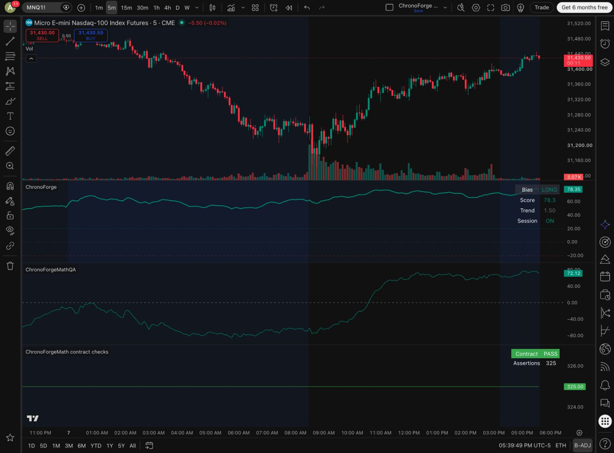
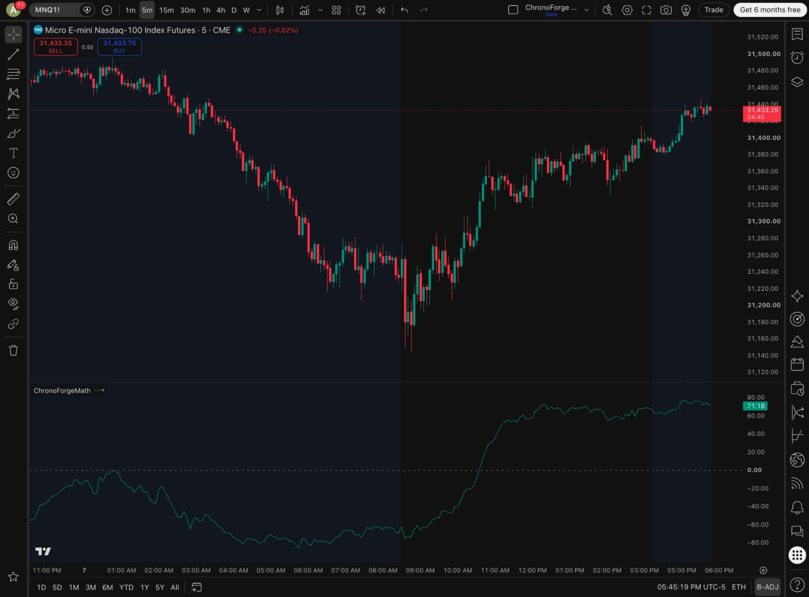
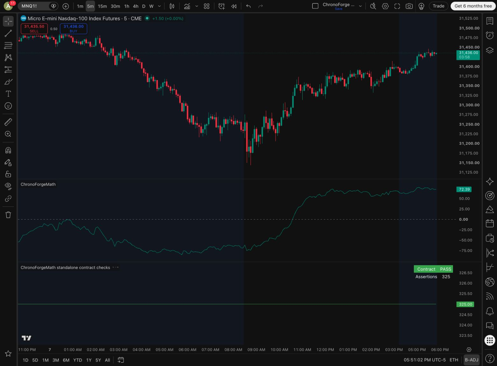
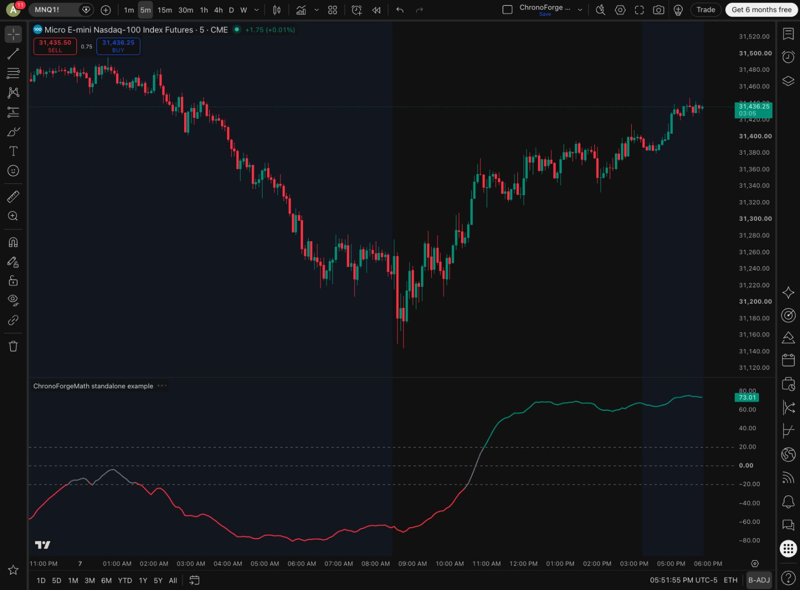

# ChronoForgeMath validation

## Native private-import check — 2026-10-07

The exact candidate `ChronoForgeMath` compiled in TradingView Pine Script v6
and displayed its chart-timeframe demo at approximately 5:45 PM America/Chicago.
The saved editor source was copied back and matched the candidate byte for byte.
A private QA publication used the name `ChronoForgeMathQA`.
Its source differs from the candidate only in that library name. Exported
function bodies match exactly; the full MIT notice is included in both copies.

A personal contract harness actually imported that private library's version 1.
TradingView reported **Compiled.** and **Added to chart.** The running chart then
showed **Contract PASS — Assertions 325** at approximately 5:38 PM America/Chicago.
This validates actual imports rather than a separate Python reimplementation.

The checks include 33 fixed expectations and grid properties for score bounds,
weight-scale invariance and nonzero-direction sign symmetry. Cases cover ATR
units/guards, positive and negative saturation, clamping, inactive-session
normalization, zero-direction boost, all-zero warmup, missing inputs, invalid
weights, and classifier boundaries/invalid thresholds.

Candidate library source SHA-256:
`fecad7d8ada7a0cb15cd832afcffdd6d0e08e6e1229446cf86eb634c97ac8713`.

The exact public candidate compiled and displayed successfully. Public
publication was then blocked: on 2026-10-07 at approximately 5:47 PM
America/Chicago, selecting Public showed an account dialog requiring a paid
plan. No public library was submitted. The public import namespace is unavailable
until that requirement is resolved and publication is authorized. The public
contract file is identical to the checked private-import harness except for its
imported library name. Neither the private publication nor the personal harness
counts as an independent external dependent project.

## Native consumer check — 2026-10-07

The higher-timeframe example imported the same private QA version 1 and
TradingView reported **Compiled.** and **Added to chart.** at approximately
5:39 PM America/Chicago. It was saved as a separate personal script at 5:43 PM.
The public example differs only in its imported library name. This verifies the
EMA tuple request, exported function calls, smoothing and plotted output can
compile together; it does not test trading outcomes or create outside adoption.

## Standalone copy check — 2026-10-07

A local contract harness with copied functions, no imports, and the existing
numeric assertions ran in TradingView Pine v6. The chart displayed
**Contract PASS — Assertions 325**. The copied function bodies match the library
exactly after accounting for the `cf_` prefixes and removed `export` qualifiers.

The complete `ChronoForgeMath-standalone.pine` indicator also reported
**Compiled.** and **Added to chart.** with default inputs in a separate personal
QA layout. Its saved editor source was copied back and matched the delivered
file byte for byte. The score and threshold lines displayed.

This path does not depend on the pending public library namespace. The full
standalone script and the function-only snippet both preserve the MIT notice.
Neither this example nor its test creates independent external adoption.

## Scope and limitations

These assertions verify the exported numeric contract for the tested inputs.
They do not establish predictive value, profitability, historical/realtime
consistency, alert delivery, webhook behavior or order execution. Inputs from
open candles can change, and session/timeframe policies belong to the caller.
The original `ChronoForge.pine` source and published indicator were preserved.
