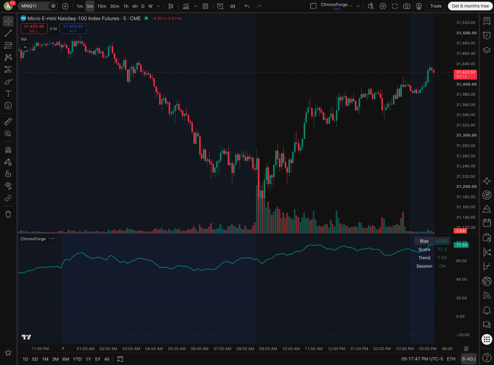

# ChronoForge validation record

## Source and environment — 2026-10-07

- Source: `ChronoForge.pine` from commit
  `cbcb98dca69be1a7c57f8a6fadbb44d69fd4f733`.
- SHA-256:
  `546f844f373f60d43d1c170ca19d02eb938cf6e00cab30c53b91d70ff011c183`.
- TradingView chart: CME_MINI:MNQ1!, standard 5-minute candles, default inputs
  including the 60-minute requested timeframe.
- Separate saved layout and script: **ChronoForge QA 2026-10-07**.

## Observed checks

TradingView's Pine Editor reported **Compiled.** and **Added to chart.** at
approximately 5:17 PM America/Chicago. The chart displayed the score oscillator,
threshold lines, session background, and status table. The screenshot captures
the observed output; its market values are temporary, not an adoption metric.

The repository source was preserved byte-for-byte while documentation was added.
The accompanying evaluation ZIP includes the source, license, security policy,
installation guide, this record, and the dated adoption register. Its file list
and checksums were checked locally before release.

## Limits of this check

This is one native compile and display smoke check. It is not a multi-symbol
validation, a historical/realtime consistency study, a strategy backtest, or
proof of signal quality. Alerts, webhooks, broker integration, and order delivery
were not tested. The indicator has no established trading-performance evidence.

The source review identified changing higher-timeframe values, exchange-timezone
session interpretation, the fixed configured-weight denominator, and the
zero-threshold ambiguity described in [QUICKSTART.md](QUICKSTART.md).
